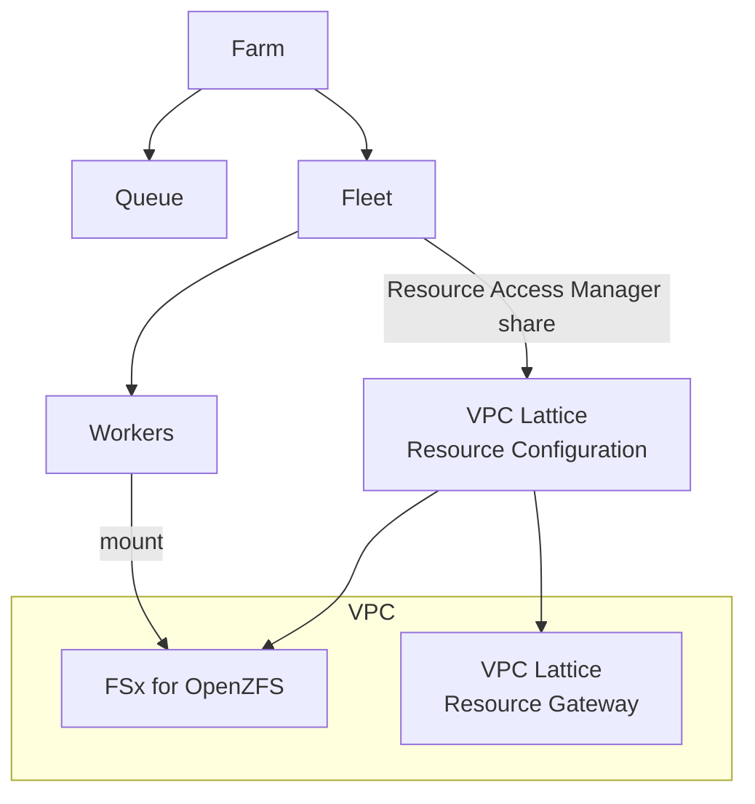

# Example: Service-Managed Fleet with VPC Resource Endpoint

This CloudFormation template demonstrates how to set up AWS Deadline Cloud with a service-managed fleet that connects to FSx for OpenZFS storage through a VPC resource endpoint. The FSx cluster runs in a VPC, and VPC Lattice resource configuration establishes the connection between Deadline workers and the storage. The resource configuration is shared with the Deadline service with a Resource Access Manager resource share.



### How to use this example

To deploy the stack:
1. Deploy the CloudFormation template: `cloudformation-template.yaml`
2. After deployment, get the FSx file system IP address from the AWS console (the IP address is only available after FSx creates the network interface):
   - Go to the FSx console and select your file system
   - Click on the "Network & security" tab
   - Find the "Network interface" section and click on the ENI ID
   - In the EC2 console, copy the "Private IPv4 address" from the network interface details
3. Update the stack with the correct FSx IP address in the `FSxClusterIP` parameter
4. The fleet workers will automatically mount the NFS share at `/mnt/fsx` when they start

To run the sample job, run the AWS CLI command:
```bash
aws deadline create-job \
  --farm-id <FARM_ID> \
  --queue-id <QUEUE_ID> \
  --template file://test-job.yaml \
  --template-type YAML \
  --priority 50
```

Replace `<FARM_ID>` and `<QUEUE_ID>` with the values from the CloudFormation stack outputs.

### Links to documentation:
- [Service-managed fleets with VPC resource endpoints](https://docs.aws.amazon.com/deadline-cloud/latest/developerguide/smf-vpc.html)
- [FSx for OpenZFS User Guide](https://docs.aws.amazon.com/fsx/latest/OpenZFSGuide/)
- [VPC Lattice User Guide](https://docs.aws.amazon.com/vpc-lattice/latest/ug/)
